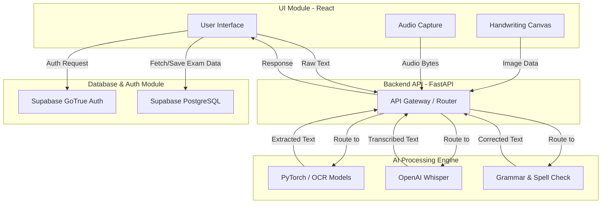

# Digital Scribe

**Digital Scribe** is a specialized, production-ready web application designed to assist students with Specific Learning Disabilities (especially dyslexia) by acting as a digital scribe during exams. 

---

## 🛑 Problem Statement
Students with Specific Learning Disabilities (such as dyslexia and dysgraphia) frequently struggle with traditional written exams and typically require a human scribe. Relying on human scribes can lead to inconsistencies, availability issues, increased costs for educational bodies, and a lack of independence and privacy for the student during examinations.

---

## 🎯 Objective
The primary objective of Digital Scribe is to solve the accessibility gap in offline and online testing by providing a secure, automated, and unbiased digital scribe. The system empowers students to take exams completely independently utilizing state-of-the-art AI-powered handwriting recognition, speech-to-text, text-to-speech, and linguistic correction—all within a highly controlled and secure exam environment.

---

## 👥 Target Users
- **Students:** Individuals with Specific Learning Disabilities (e.g., dyslexia, dysgraphia) requiring examination accommodations.
- **Educational Institutions:** Schools and universities seeking scalable, accessible exam solutions.
- **Exam Boards:** Official bodies needing reliable and standardized reasonable adjustment tools for standardized testing.

---

## ✅ What Your Project Does
- Translates live-drawn handwritten canvas inputs or uploaded images into digital text.
- Provides real-time speech transcription (Speech-to-Text) allowing users to dictate exam answers.
- Reads aloud text and exam questions using synthesized audio (Text-to-Speech) to assist with reading comprehension.
- Dynamically checks and corrects spelling and grammatical errors without altering the core semantic meaning of the student's answer.
- Operates within a hardened, secure interface designed for high-stakes test conditions.

---

## ❌ What It Does NOT Do (Limitations)
- **Provide Exam Answers:** It is not an AI tutor or conversational chatbot (like ChatGPT) that answers questions; it strictly transcribes, reads, and formats the user's own input.
- **Unrestricted Web Browsing:** It does not allow users to search the internet or access external materials during the exam session.
- **Perfect Handwriting Parsing in All Conditions:** Extremely faint or heavily scribbled text may have reduced accuracy and require manual correction by the student.
- **Generic Word Processing:** It is tightly focused on exam-taking workflows rather than complex multi-page document formatting.

---

## 🚀 Features / Functionalities
- **Handwriting Recognition:** ML models process canvas strokes or images into standard digital text.
- **Speech-to-Text (STT):** Precise dictation engine supporting various accents and cadences.
- **Text-to-Speech (TTS):** Natural sounding voice readout functionalities for visual/reading assistance.
- **Spelling & Grammar Correction:** Automated spelling correction and grammar adjustments to ensure user answers are perfectly legible.
- **Multi-Language Support:** Ability to detect and process inputs across various languages.
- **Secure Exam Environment:** Restricted session management ensuring exam integrity.

---

## 🏗️ High-Level Diagram & Data Flow



### Flow of Data
1. **Frontend (User Input):** The user interacts with the UI module by drawing on the canvas, dictating via microphone, or logging in.
2. **Backend (Routing):** The React frontend sends these multimodal data payloads (images, audio, text) securely to the FastAPI backend.
3. **AI Model (Processing Engine):** The FastAPI routers pass the data to the respective AI inference scripts (Whisper for audio, OCR models for visual data, Symspell/Transformers for text).
4. **Backend to Frontend (Delivery):** The AI module returns the generated text or processed data back to the backend, which formats the response to the frontend for the user to review.
5. **Database (Persistence & Auth):** All data state (user sessions, finished exams, audit logs) is stored securely in the Supabase PostgreSQL database via direct frontend/backend integration.

---

## 🛠️ Tech Stack

### Frontend
- **Framework:** React 18, Vite
- **Styling:** Tailwind CSS, PostCSS
- **Icons:** Lucide React
- **Client library:** `@supabase/supabase-js`

### AI Service (Backend)
- **Framework:** FastAPI, Uvicorn (Python)
- **Deep Learning / AI:** PyTorch, Transformers (Hugging Face)
- **Speech Models:** OpenAI Whisper
- **Text Processing:** `symspellpy`, `langdetect`
- **Image Processing:** Pillow (`PIL`)

### Database & Authentication
- **Provider:** Supabase (PostgreSQL, GoTrue for Auth)

---

## 💻 Installation & Setup Guide

### Prerequisites
- **Node.js** (v18 or higher)
- **Python** (v3.9 or higher)
- **Git**
- **Supabase Account / Project IDE** 

### Step-by-Step Instructions

**1. Clone the repository**
```bash
git clone https://github.com/your-username/digital-scribe.git
cd digital-scribe
```

**2. Set up the Frontend**
```bash
cd frontend
npm install
```
*Create a `.env.local` file in the `frontend` directory with your Supabase credentials:*
```env
VITE_SUPABASE_URL=your_supabase_project_url
VITE_SUPABASE_ANON_KEY=your_supabase_anon_key
```

**3. Set up the AI Service (Backend)**
```bash
cd ../ai_service
# Create a virtual environment
python -m venv venv

# Activate the virtual environment
# On Windows:
venv\Scripts\activate
# On macOS/Linux:
source venv/bin/activate

# Install dependencies
pip install -r requirements.txt
```

**4. Run the Application Locally**
You will need two terminal windows to run both services.

*Terminal 1: Start Backend*
```bash
cd ai_service
# Activate virtual environment if not already activated
uvicorn app.main:app --reload --host 0.0.0.0 --port 8000
```

*Terminal 2: Start Frontend*
```bash
cd frontend
npm run dev
```
The React app will be running at `http://localhost:5173` and the backend Swagger documentation will be accessible at `http://localhost:8000/docs`.

---

## 🧩 Modules Description

### 1. Authentication Module
Managed entirely via Supabase GoTrue, this module handles secure user registration, log in, session persistence, and role-based access control (differentiating between student candidates and administrative proctors). It ensures the exam environment cannot be accessed maliciously.

### 2. AI Processing Engine (Substitute for Recommendation Engine)
The core brain of the application. Instead of recommending content, this engine utilizes Deep Learning to recommend corrections and process multimodal inputs:
- **Speech/Audio Submodule:** Utilizes OpenAI Whisper to transcribe spoken dictation into high-fidelity text.
- **Vision Submodule:** Uses PyTorch-based OCR methodologies to translate drawn canvas arrays into text strings.
- **NLP Submodule:** Checks the resultant text for errors and suggests grammatical corrections dynamically using `symspellpy` and HuggingFace models.

### 3. UI Module
A robust, accessible React.js interface leveraging TailwindCSS for styling. It features multiple high-interactivity components such as an HTML5 Canvas drawing board, a secure microphone recorder component, and a distraction-free exam layout for maximized focus. 

### 4. Database Module
Powered by PostgreSQL (hosted on Supabase). It stores the underlying schemas for Users, Exam Sessions, Saved Transcripts, and Audit trails. Row Level Security (RLS) is applied to ensure strict isolation of exam data between multiple testing candidates.
